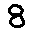
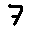
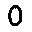

## Neural Numbers

   

This is an example of how to recognise numbers from small digital images.

I'm using Lua as the programming language and Torch as the framework for neural networks and image reading.

## Links

- Lua - https://luarocks.org/
- Torch - http://torch.ch/
- LuaJIT - http://luajit.org/
- nn - https://github.com/torch/nn
- image - https://github.com/torch/image
